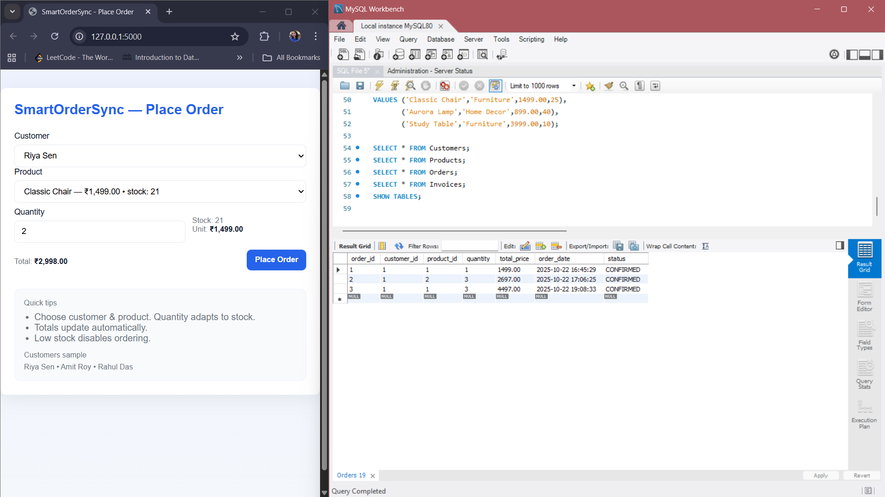

**Overview**

This project is a back-end simulation of a crucial business process: automating the seamless, high-integrity transfer of data between an e-commerce platform and the Enterprise Resource Planning (ERP) data core. It demonstrates mastery of database architecture, transactional reliability, and Object-Oriented Programming (OOP) to achieve end-to-end Business Process Automation (BPA).

*Core Features and Business Value*

The solution is designed to eliminate manual data entry, prevent stock discrepancies, and ensure financial records are updated instantly.

Transactional Integrity (ACID Compliance): Ensures every order update (stock reduction + sales record creation) is treated as a single, atomic unit. If one step fails, the entire transaction rolls back, guaranteeing data consistency.

Real-Time Data Synchronization: Orders are synchronized instantly from the mock E-commerce Frontend to the centralized database, reducing inventory discrepancies.

High-Integrity Data Core Design: Implements a fully normalized relational schema (MySQL) using foreign keys to enforce strict referential integrity across Customer, Product, and Order tables.

OOP-Driven Business Logic: Modeled core ERP entities (Customer, Product, Order) using Python OOP, encapsulating inventory management and sales ledger (Invoice) creation within the Order class for atomic transaction execution.

*Business Process Flow*

The project models the following automated workflow:

Order Placement: A user interacts with the Frontend to submit a new order.

API Call / Script Execution: The Python back-end service receives the order data.

Transactional Logic: The Python code executes a single database transaction which performs the following steps simultaneously:

Verifies product availability and status.

Decrements the corresponding Product.Stock count.

Creates a new record in the Orders table.

Creates or updates the relevant entry in the simulated Sales Ledger.

Confirmation: The Frontend receives an updated status confirming successful order processing and inventory synchronization.

**Setup and Installation**

*Prerequisites*

Python 3.x

MySQL Server (Local or Remote)
